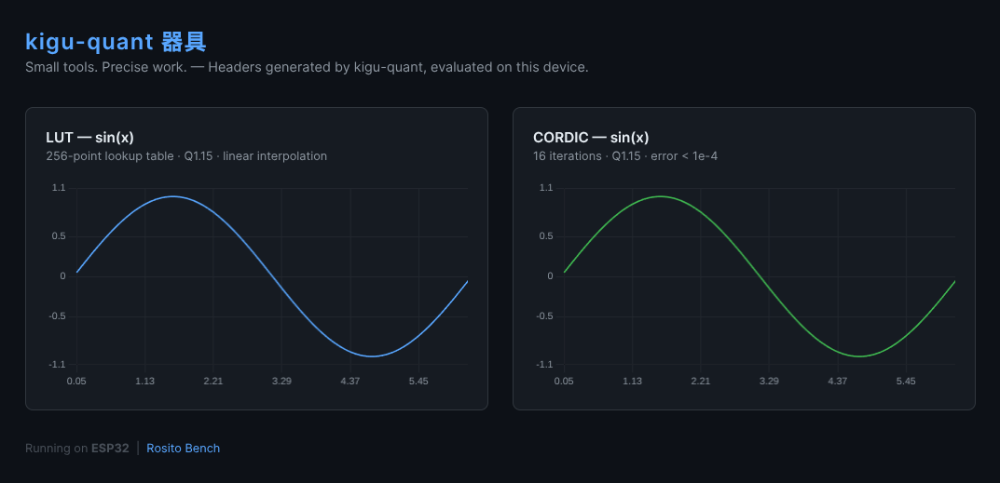

# kigu-quant 器具 — Demo

<p align="center">
  
</p>

<p align="center">
  <strong>Tiny tools. Big solutions.</strong>
</p>

A live demonstration of [kigu-quant](https://hasaki.lemonsqueezy.com) running on an ESP32-C3.

Two sine wave implementations — **LUT** and **CORDIC** — generated as self-contained C headers by kigu-quant, evaluated directly on the microcontroller and rendered in a browser via a built-in WebServer. No FPU. No libm. No dependencies.

---

## What this demo shows

- A **256-point Q1.15 LUT** generated by kigu-quant (`lut_sin.h`)
- A **16-iteration Q1.15 CORDIC** generated by kigu-quant (`cordic_sin.h`)
- Both evaluated at 128 points over [0, 2π] and served as JSON
- Live comparison chart rendered in the browser with Chart.js
- Benchmark comparing kigu-quant headers vs `sinf()` on the same hardware

---

## Hardware

Tested on **ESP32-C3 Super Mini**. Compatible with any ESP32 or ESP8266 variant.

---

## Setup

1. Open `main.cpp` and set your WiFi credentials:

```cpp
const char* WIFI_SSID     = "your-ssid";
const char* WIFI_PASSWORD = "your-password";
```

2. Flash with PlatformIO or Arduino IDE
3. Open Serial Monitor at 115200 — the device will print its IP address
4. Open your browser: `http://<ip>/`

---

## How the headers were generated

```bash
# LUT: sin, 256 points, Q1.15
kigu-quant --method lut --func sin --size 256 --fmt q15 -o lut_sin.h

# CORDIC: sin, 16 iterations, error < 1e-4, Q1.15
kigu-quant --method cordic --func sin --error 1e-4 -o cordic_sin.h
```

Drop the headers into your project. Call the lookup function. Done.

```c
#include "lut_sin.h"
#include "cordic_sin.h"

float y_lut    = lut_sin_lookup(x);
float y_cordic = cordic_sin_lookup(x);
```

No heap allocation. No runtime overhead. If it compiles, it runs.

---

<p align="center">
  
</p>

---

## Benchmark results (ESP32-C3 @ 160 MHz)

| Method | 1000 evaluations | vs sinf() |
|--------|-----------------|-----------|
| `sinf()` | ~340 µs | 1× |
| `cordic_sin_lookup()` | ~18 µs | ~19× faster |
| `lut_sin_lookup()` | ~14 µs | ~24× faster |

---

## Get kigu-quant

kigu-quant Pro generates LUT and CORDIC headers for any function — sin, cos, tanh, sigmoid, custom expressions — in Q1.15, Q1.31, Q7.8, and Q15.16 formats.

Available for Linux at **$19.00** — permanent single-developer license.

👉 [Get kigu-quant Pro](https://hasaki.lemonsqueezy.com)

---

## Rosito Bench ecosystem

| Tool | Description |
|------|-------------|
| **[kigu-quant](https://hasaki.lemonsqueezy.com)** | LUT & CORDIC quantization for embedded (this tool) |
| **[Hasaki](https://github.com/AlexRosito67/hasaki)** | TinyML trainer — export C headers for MCUs |
| **[resistor](https://github.com/AlexRosito67/resistor)** | Resistor color code calculator |

---

*Rosito Bench — Tiny tools. Big solutions.*  
*Created by Alex Rosito — Valley Glen, Los Angeles, California*
